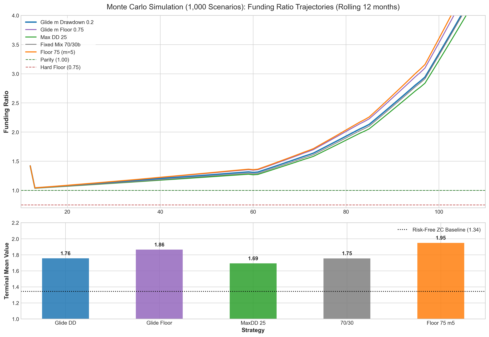
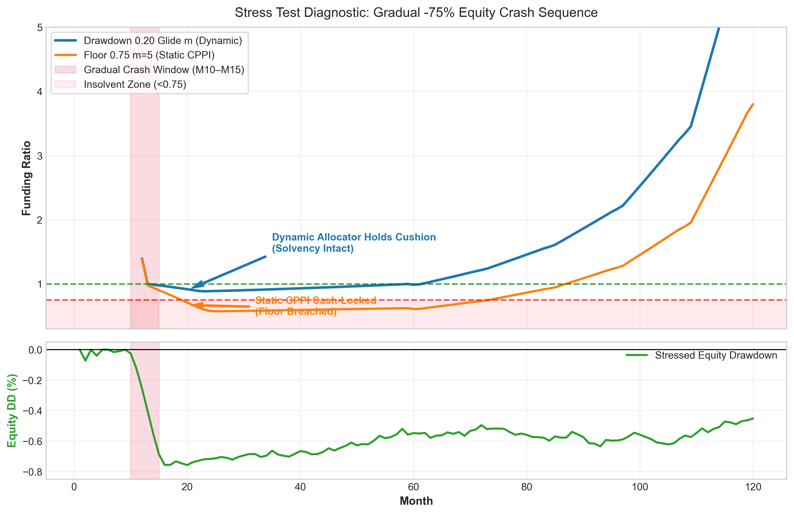
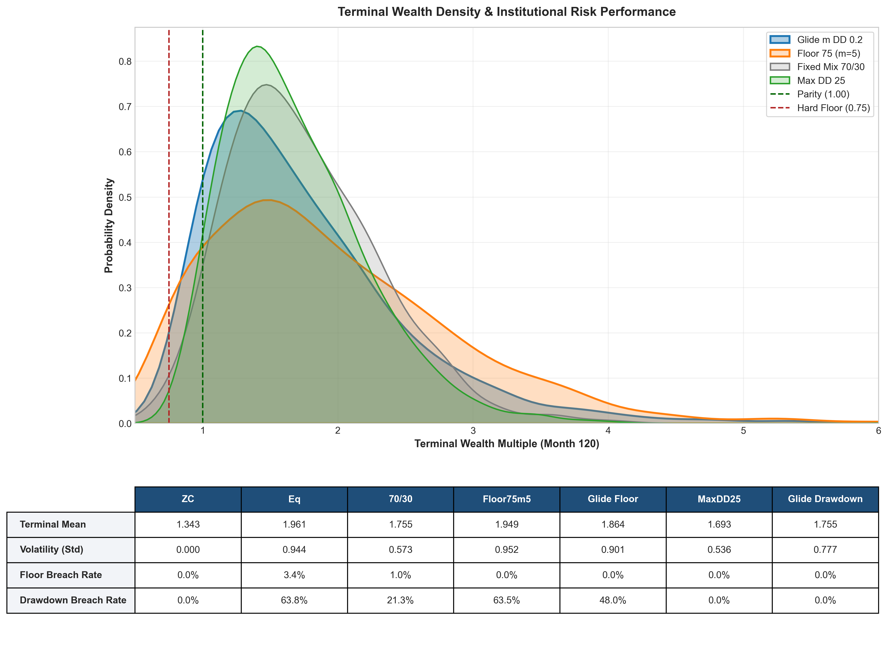

Dynamic LDI Cushion Defense & Risk-Managed Glide PathsAn institutional-grade quantitative framework evaluating Liability-Driven Investment (LDI) dynamic asset allocation strategies. This project benchmarks novel Dynamic Glide-Path Allocators against traditional Constant Proportion Portfolio Insurance (CPPI) models and fixed-mix allocations under 1,000-path Monte Carlo simulations and multi-month stress tests.Executive SummaryTraditional CPPI strategies rely on a constant multiplier ($m$) applied to a portfolio cushion ($C$). During market crises, these static designs suffer from the "Cash-Lock Trap"—once a severe shock consumes the cushion, equity allocation drops to $0\%$, forcing the portfolio into zero-coupon liability hedging assets (LHP) permanently and forfeiting post-crisis recovery.This repository implements dynamic glide-path allocators that modulate multiplier dynamics based on rolling drawdown thresholds and liability duration, eliminating floor breaches ($p_{\text{breach}} = 0.0\%$) while retaining upside recovery potential under severe prolonged stress.Core Methodology1. Liability Matching & Funding Ratio DynamicsThe liability stream consists of multi-period cash obligations. Portfolio solvency is tracked continuously via the Funding Ratio ($\text{FR}_t$):$$\text{FR}_t = \frac{\text{Assets}_t}{\text{PV}_t(\text{Remaining Liabilities})}$$Where $\text{PV}_t(L)$ is calculated using zero-coupon bond pricing discount factors:$$\text{PV}_t(L) = \sum_{k} L_k \cdot P(t, T_k)$$2. Dynamic Asset Allocation FormulaAt each month $t$, asset returns combine a Return Generating Asset (Pure Equity) and a Liability Hedging Portfolio (Zero-Coupon Bonds):$$w_{\text{eq}, t} = \text{clip}\left( m_t \times \frac{\text{Assets}_t - \text{Floor}_t}{\text{Assets}_t}, \; 0, \; 1 \right)$$Static CPPI: Constant $m$ (e.g., $m=5$).Glide Drawdown Allocator: Dynamic $m_t$ that scales multiplier $m$ proportionally with portfolio drawdown recovery, preventing sudden deleveraging shocks.3. Stress Test EngineRather than relying on unrealistic single-period jump shocks, market stress is modeled as a gradual 6-to-10 month market erosion reaching $-75\%$ peak-to-trough drawdown, testing dynamic rebalancing execution under realistic liquidity constraints.Visualizations1. Multi-Strategy Funding Ratio TrajectoriesTracks expected rolling funding ratio progression across 1,000 Monte Carlo paths. As liabilities amortize past Month 60, funding ratios exhibit natural exponential upward drift due to shrinking denominator liability obligations.2. Stress Test Diagnostic: Dynamic vs. Static ResponseA two-panel diagnostic contrasting Glide Drawdown against Static CPPI ($m=5$) under a gradual $-75\%$ market crash (Months 10–15).Static CPPI suffers a cash-lock at Month 15, freezing allocation and permanently flattening recovery.Glide Drawdown dynamically reduces risk exposure prior to floor breach, retaining capital cushion to participate in subsequent market recovery.3. Terminal Wealth Probability Density & Risk MetricsKernel Density Estimation (KDE) highlighting asymmetric right-skewed outcomes while showing zero left-tail leakage past the $0.75$ hard solvency floor.

View the main simulation notebook: [LDI Dynamic Risk Simulation](LDI_Dynamic_Risk_Stress.ipynb)
Core quantitative module: [`edhec_risk_kit.py`](quant_risk_kit.py)