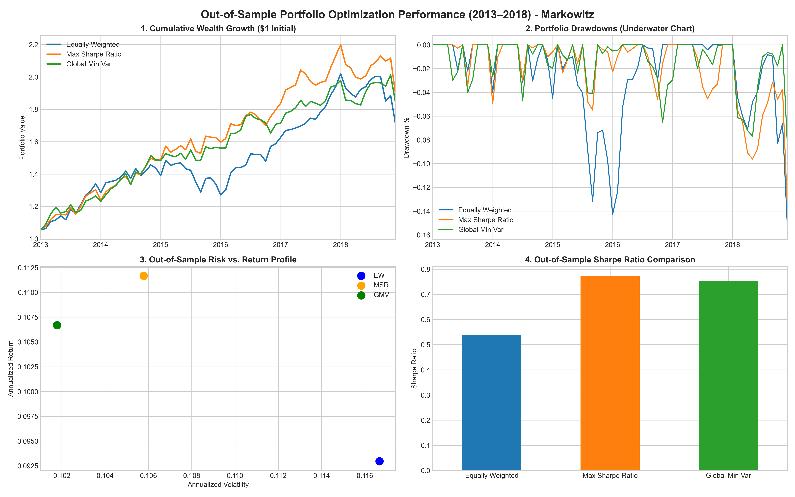

# Out-of-Sample Portfolio Optimization & Backtesting Engine

A quantitative finance project evaluating the out-of-sample performance of Markowitz Mean-Variance Optimization (MSR), Global Minimum Variance (GMV), and Naïve Equal Weighting (1/N) strategies across 30 sector portfolios.

## Overview
* In-Sample Period (Training): 2009 – 2013
* Out-of-Sample Period (Testing): 2013 – 2018
* Key Finding: Global Minimum Variance (GMV) achieved the lowest volatility (10.17%) while retaining a Sharpe ratio (0.753) virtually identical to Maximum Sharpe Ratio (0.772), proving its resistance to parameter estimation error.

## Project Structure
* Marko_Portfolio_Optimization.ipynb: Main analysis and backtesting pipeline.
* edhec_risk_kit.py: Custom module containing risk metrics, optimization functions, and return calculations.
* portfolio_dashboard.png: 4-panel performance summary chart.

## Tech Stack
Python | Pandas | NumPy | SciPy (Optimization) | Matplotlib | Seaborn
